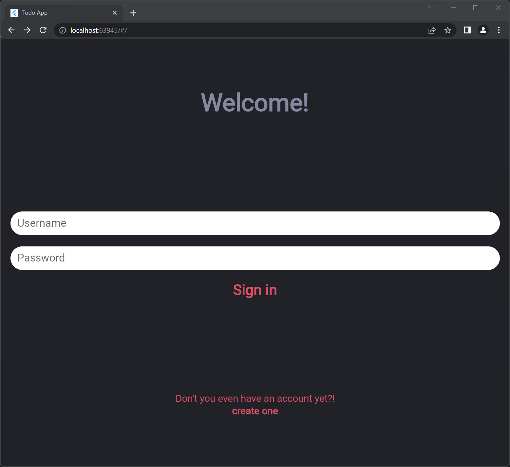

# TodoApp1

参照にあるGitHubリポジトリを参照して、再度開発し直した。しかし、**現時点ではログインページより後ろに進むことができない。**



# ディレクトリ構造

## Flutter側(フロントエンド)

主にUI設計やFlaskとの連携を担当。

```powershell
│  main.dart # アプリのコア部分
│  
├─bloc
│  ├─blocs
│  │      user_bloc_provider.dart #状態管理。rxdartパッケージで実装。
│  │      
│  └─resources
│          api.dart #Flaskで開発したREST APIとの連携
│          repository.dart #アプリ内で行う処理の関数をまとめたもの
│
├─models
│  │  global.dart #アプリ内で使う色に変数をつけたファイル
│  │
│  ├─authentication
│  │      authorize.dart #認可システム
│  │
│  ├─classes
│  │      task.dart #タスクのモデル
│  │      user.dart #ユーザのモデル
│  │
│  └─widgets
│          intray_todo_widget.dart #おそらく完了済みのタスクを表示するWidget
│
└─UI
    ├─Intray
    │      intray_page.dart #完了済みのタスクを表示するページ
    │
    └─Login
            loginscreen.dart #ログインページ
```

状態管理は`rxdart`パッケージで実装。**`getx`や`riverpod`のような今時のパッケージを使って実装する場合とはまた癖があった。**

`lib/bloc/resources/api.dart`(基本的にFlaskで開発したREST APIとの連携を担当。**アプリの基本処理をAPIを用いて実装している**)

```dart
import 'dart:async';
import 'package:http/http.dart' show Client;
import 'package:shared_preferences/shared_preferences.dart';
import 'package:todoapp/models/classes/task.dart';
import 'dart:convert';
import 'package:todoapp/models/classes/user.dart';

class ApiProvider {
  Client client = Client();
  final _apiKey = 'your_api_key';

  Future<User> registerUser(String username, String firstname, String lastname, String password, String email) async {
    final response = await client
        .post("http://127.0.0.1:5000/api/register",
        // headers: "",
        body: jsonEncode(
          {
          	"emailadress" : email,
	          "username" : username,
	          "password" : password,
	          "firstname" : firstname,
	          "lastname" : lastname
        }
        ) 
        );
    final Map result = json.decode(response.body);
    if (response.statusCode == 201) {
      // If the call to the server was successful, parse the JSON
      await saveApiKey(result["data"]["api_key"]);
      return User.fromJson(result["data"]);
    } else {
      // If that call was not successful, throw an error.
      throw Exception('Failed to load post');
    }
  }

  Future signinUser(String username, String password, String apiKey) async {
    final response = await client
        .post("http://127.0.0.1:5000/api/signin",
        headers: {
          "Authorization" : apiKey
        },
        body: jsonEncode(
          {
	          "username" : username,
	          "password" : password,
        }
        ) 
        );
    final Map result = json.decode(response.body);
    if (response.statusCode == 201) {
      // If the call to the server was successful, parse the JSON
      await saveApiKey(result["data"]["api_key"]);
    } else {
      // If that call was not successful, throw an error.
      throw Exception('Failed to load post');
    }
  }

  Future<List<Task>> getUserTasks(String apiKey) async {
    final response = await client
        .get("http://127.0.0.1:5000/api/tasks",
        headers: {
          "Authorization" : apiKey
        },
        );
    final Map result = json.decode(response.body);
    if (response.statusCode == 201) {
      // If the call to the server was successful, parse the JSON
      List<Task> tasks = [];
      for (Map json_ in result["data"]) {
        try {
          tasks.add(Task.fromJson(json_));
        }
        catch (Exception) {
          print(Exception);
        }
      }
      for (Task task in tasks) {
        print(task.taskId);
      }
      return tasks;
    } else {
      // If that call was not successful, throw an error.
      throw Exception('Failed to load tasks');
    }
  }

  Future addUserTask(String apiKey, String taskName, String deadline) async {
    final response = await client
        .post("http://127.0.0.1:5000/api/tasks",
        headers: {
          "Authorization" : apiKey
        },
        body: jsonEncode({
          "note" : "",
	        "repeats" : "",
	        "completed" : false,
	        "deadline" : deadline,
	        "reminders" : "",
	        "title" : taskName 
        })
        );
    if (response.statusCode == 201) {
      print("Task added");
    } else {
      // If that call was not successful, throw an error.
      print(json.decode(response.body));
      throw Exception('Failed to load tasks');
    }
  }

 saveApiKey(String api_key) async {
    SharedPreferences prefs = await SharedPreferences.getInstance();
    await prefs.setString('API_Token', api_key);
 }
}
```

`lib/bloc/blocs/user_bloc_provider.dart`

主に`rxdart`による状態管理を実装。少し変わった実装方法だったので多少面倒だった。

```dart
import 'package:todoapp/models/classes/task.dart';

import '../resources/repository.dart';
import 'package:rxdart/rxdart.dart';
import 'package:todoapp/models/classes/user.dart';

class UserBloc {
  final _repository = Repository();
  final _userGetter = PublishSubject<User>();

  Observable<User> get getUser => _userGetter.stream;

  registerUser(String username, String firstname, String lastname, String password, String email) async {
    User user = await _repository.registerUser(username, firstname, lastname, password, email);
    _userGetter.sink.add(user);
  }

  signinUser(String username, String password, String apiKey) async {
    User user = await _repository.signinUser(username, password, apiKey);
    _userGetter.sink.add(user);
  }

  dispose() {
    _userGetter.close();
  }
}

class TaskBloc {
  final _repository = Repository();
  final _taskSubject = BehaviorSubject<List<Task>>();
  String apiKey;

  var _tasks = <Task>[];

  TaskBloc(String api_key) {
    this.apiKey = api_key;
    _updateTasks(api_key).then((_) {
      _taskSubject.add(_tasks);
    });
  }


  Stream<List<Task>> get getTasks => _taskSubject.stream;

  Future<Null> _updateTasks(String apiKey) async {
    _tasks = await _repository.getUserTasks(apiKey);
  }

}
final userBloc = UserBloc();
```

ちなみにすべてAPI経由で実装しているので`Future`を使った非同期通信で実装を行っている。

## Flask側(バックエンド)

データベースとの連携、REST APIの設計や認証機能の実装を担当。ちなみに認証機能はToken認証をフル活用した。**ちなみにルーティング設定はFlask側で設定した。**

```powershell
C:.
│  app.py
│  config.py
│  migrate.py
│  models.py
│  requirements.txt
│  run.py
│  __init__.py
│
├─migrations
│  │  alembic.ini
│  │  env.py
│  │  README
│  │  script.py.mako
│  │
│  └─versions
│          274b68063340_.py
│          b03849ed06fd_.py
│
├─resources
│  │  project.py
│  │  Register.py
│  │  Signin.py
│  │  supportfile.py
│  │  task.py
│  │  tasks
│  │  User.py
│  │  __init__.py
│  │
│  └─__pycache__
│          Register.cpython-310.pyc
│          Signin.cpython-310.pyc
│          task.cpython-310.pyc
│          __init__.cpython-310.pyc
│
└─__pycache__
        app.cpython-310.pyc
        config.cpython-310.pyc
        models.cpython-310.pyc
```

基本的には`api.py`を中心にアプリのルーティングを設定している。

```py
from flask import Blueprint
from flask_restful import Api
from resources.Register import Register
from resources.Signin import Signin
from resources.task import Tasks

api_bp = Blueprint('api', __name__)
api = Api(api_bp)

# Route
api.add_resource(Register, '/register')

api.add_resource(Signin, '/signin')

api.add_resource(Tasks, '/tasks')
```

# エラーが発生している箇所

`lib/UI/Login/loginscreen.dart`(エラーが出力されているファイル)

```dart
import 'package:flutter/material.dart';
import 'package:todoapp/bloc/blocs/user_bloc_provider.dart';
import 'package:shared_preferences/shared_preferences.dart';
import 'package:todoapp/models/classes/user.dart';
import 'package:todoapp/models/global.dart';

class LoginPage extends StatefulWidget {
  final VoidCallback login;
  final bool newUser;

  const LoginPage({Key key, this.login, this.newUser}) : super(key: key);
  @override
  _LoginPageState createState() => _LoginPageState();
}

class _LoginPageState extends State<LoginPage> {
  TextEditingController emailController = new TextEditingController();
  TextEditingController usernameController = new TextEditingController();
  TextEditingController firstNameController = new TextEditingController();
  TextEditingController passwordController = new TextEditingController();
  @override
  Widget build(BuildContext context) {
    return Scaffold(
      backgroundColor: darkGreyColor,
      body: Center(
        child: widget.newUser ? getSignupPage() : getSigninPage(),
      ),
    );
  }

  Widget getSigninPage() {
    TextEditingController usernameText = new TextEditingController();
    TextEditingController passwordText = new TextEditingController();
    return Container(
      margin: EdgeInsets.only(top: 100, left: 20, right: 20, bottom: 100),
      child: Column(
        mainAxisAlignment: MainAxisAlignment.spaceBetween,
        children: <Widget>[
          Text("Welcome!", style: bigLightBlueTitle),
          Container(
            height: 200,
            child: Column(
              mainAxisAlignment: MainAxisAlignment.spaceAround,
              children: <Widget>[
                Theme(
                  data: Theme.of(context)
                      .copyWith(splashColor: Colors.transparent),
                  child: TextField(
                    controller: usernameText,
                    autofocus: false,
                    style: TextStyle(fontSize: 22.0, color: darkGreyColor),
                    decoration: InputDecoration(
                      filled: true,
                      fillColor: Colors.white,
                      hintText: 'Username',
                      contentPadding: const EdgeInsets.only(
                          left: 14.0, bottom: 8.0, top: 8.0),
                      focusedBorder: OutlineInputBorder(
                        borderSide: BorderSide(color: Colors.white),
                        borderRadius: BorderRadius.circular(25.7),
                      ),
                      enabledBorder: UnderlineInputBorder(
                        borderSide: BorderSide(color: Colors.white),
                        borderRadius: BorderRadius.circular(25.7),
                      ),
                    ),
                  ),
                ),
                Theme(
                  data: Theme.of(context)
                      .copyWith(splashColor: Colors.transparent),
                  child: TextField(
                    controller: passwordText,
                    autofocus: false,
                    style: TextStyle(fontSize: 22.0, color: darkGreyColor),
                    decoration: InputDecoration(
                      filled: true,
                      fillColor: Colors.white,
                      hintText: 'Password',
                      contentPadding: const EdgeInsets.only(
                          left: 14.0, bottom: 8.0, top: 8.0),
                      focusedBorder: OutlineInputBorder(
                        borderSide: BorderSide(color: Colors.white),
                        borderRadius: BorderRadius.circular(25.7),
                      ),
                      enabledBorder: UnderlineInputBorder(
                        borderSide: BorderSide(color: Colors.white),
                        borderRadius: BorderRadius.circular(25.7),
                      ),
                    ),
                  ),
                ),
                TextButton(
                  child: Text(
                    "Sign in",
                    style: redTodoTitle,
                  ),
                  onPressed: () {
                    if (usernameText.text != null ||
                        passwordText.text != null) {
                      userBloc
                          .signinUser(usernameText.text, passwordText.text, "")
                          .then((_) {
                        widget.login();
                      });
                    }
                  },
                )
              ],
            ),
          ),
          Container(
            child: Column(
              children: <Widget>[
                Text(
                  "Don't you even have an account yet?!",
                  style: redText,
                  textAlign: TextAlign.center,
                ),
                TextButton(
                    child: Text("create one", style: redBoldText),
                    onPressed: () {
                      getSignupPage();
                    }) // おそらくonPressedがうまく機能していない可能性がある
              ],
            ),
          )
        ],
      ),
    );
  }

  Widget getSignupPage() {
    return Container(
      margin: EdgeInsets.all(20),
      child: Column(
        children: <Widget>[
          TextField(
            controller: emailController,
            decoration: InputDecoration(hintText: "Email"),
          ),
          TextField(
            controller: usernameController,
            decoration: InputDecoration(hintText: "Username"),
          ),
          TextField(
            controller: firstNameController,
            decoration: InputDecoration(hintText: "First name"),
          ),
          TextField(
            controller: passwordController,
            decoration: InputDecoration(hintText: "Password"),
          ),
          TextButton(
            child: Text("Sign up for gods sake"),
            onPressed: () {
              if (usernameController.text != null ||
                  passwordController.text != null ||
                  emailController.text != null) {
                userBloc
                    .registerUser(
                        usernameController.text,
                        firstNameController.text ?? "",
                        "",
                        passwordController.text,
                        emailController.text)
                    .then((_) {
                  widget.login();
                });
              }
            },
          )
        ],
      ),
    );
  }
}

```

▼エラーが発生している部分

```dart
TextButton(
    child: Text("create one", style: redBoldText),
    onPressed: () {
        getSignupPage();
    }) // おそらくonPressedがうまく機能していない可能性がある
```

▼エラーメッセージ。`Error: XMLHttpRequest error.`と出力された

```
Error: XMLHttpRequest error.
C:/b/s/w/ir/cache/builder/src/out/host_debug/dart-sdk/lib/_internal/js_dev_runtime/private/ddc_runtime/errors.dart
299:10  createErrorWithStack
C:/b/s/w/ir/cache/builder/src/out/host_debug/dart-sdk/lib/_internal/js_dev_runtime/patch/core_patch.dart 341:28
_throw
C:/b/s/w/ir/cache/builder/src/out/host_debug/dart-sdk/lib/core/errors.dart 116:5
throwWithStackTrace
C:/b/s/w/ir/cache/builder/src/out/host_debug/dart-sdk/lib/async/zone.dart 1378:11
callback
C:/b/s/w/ir/cache/builder/src/out/host_debug/dart-sdk/lib/async/schedule_microtask.dart 40:11
_microtaskLoop
C:/b/s/w/ir/cache/builder/src/out/host_debug/dart-sdk/lib/async/schedule_microtask.dart 49:5
_startMicrotaskLoop
C:/b/s/w/ir/cache/builder/src/out/host_debug/dart-sdk/lib/_internal/js_dev_runtime/patch/async_patch.dart 166:15
<fn>
```

# 開発環境

* Windows 11
* Flask
* Flutter 3
* Visual Studio Code

# 参照

* [TodoApp - Github](https://github.com/KalleHallden/TodoApp)